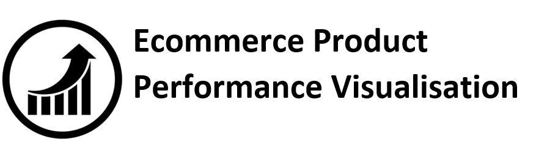
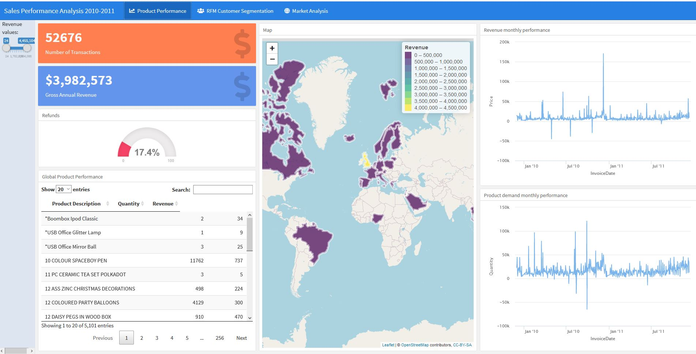
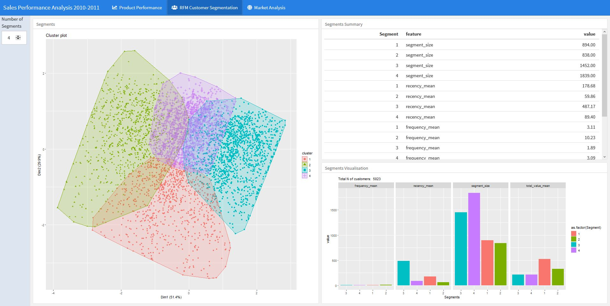
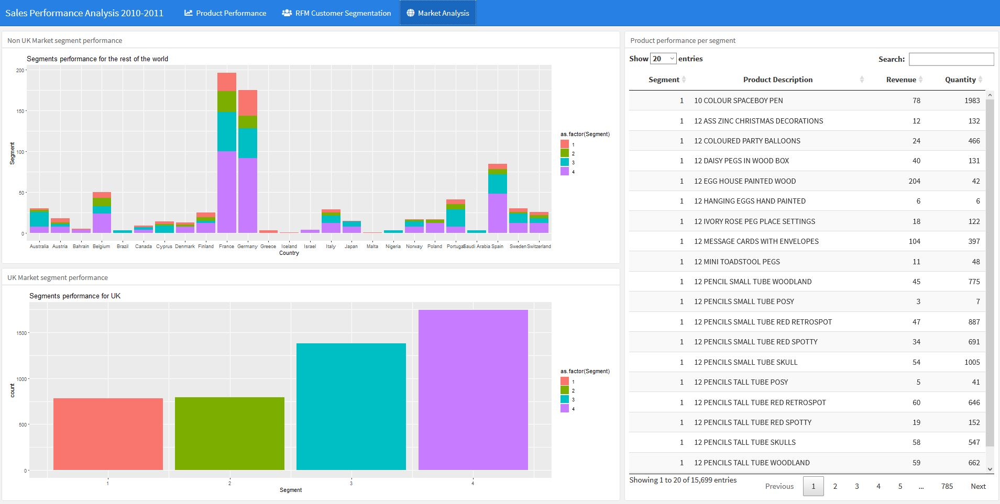

## Summary Description

This repository contains code for development of interactive dashboard tracking product performance of ecommerce company. The data used is the widely used data set from the UK retailer, you ca find it [here](https://www.kaggle.com/mashlyn/online-retail-ii-uci). 
The dashboard was built in shiny flexdashboard. You can find the repository of flexdashboard [here](https://github.com/rstudio/flexdashboard)
The output of the code is hosted for the moment [here]( https://dg0485.shinyapps.io/Sales_Report/).As the data set is quite large it might take a while to load. 
Before loading the app take a quick look at the screenshots below to see whether you are really want to explore further the app interactivity.

## Objective

This app was developed to serve as a template for building a basic interactive dashboard summarising product performance. The cool feature of the app is the interactive visualisation of K-Means model segmenting the customer base of the retailer. the code thaty generates the data for the model lives [here](./data_modelling.R) The dashboard is fully customisable. You can change the layout, the colours, the widgets pretty much everything. Flexdashboard uses CSS, so you can customise entirely the user experience. 

## Disclaimer 

The dashboard was build on quite large data set. This makes the rendering of the code quite slow.

## Repository Content

The main file of the repository is the code of the shiny app and you can find it [here](./Sales_Report.Rmd)
